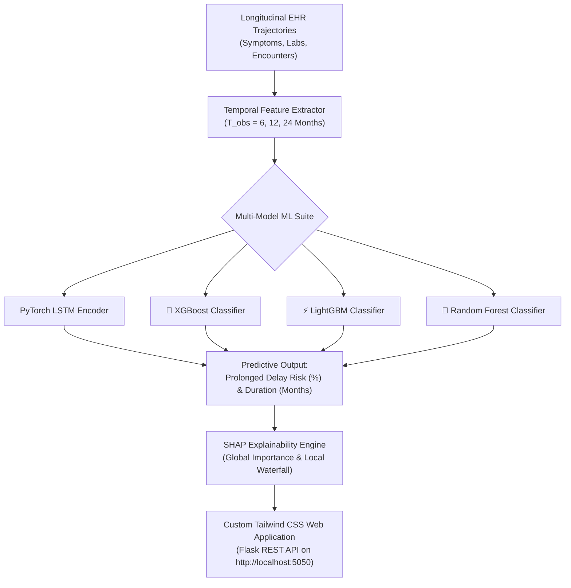

# 🩸 Explainable Longitudinal Machine Learning Framework for Predicting Prolonged Diagnostic Delay in Systemic Lupus Erythematosus and Sjögren's Disease


An end-to-end explainable longitudinal machine learning framework designed to predict and prevent **Prolonged Diagnostic Delay ($>24$ Months)** in **Systemic Lupus Erythematosus (SLE)** and **Sjögren's Disease (SjD)** using longitudinal Electronic Health Records (EHR) trajectories.

---

## 📌 Clinical Motivation & Problem Statement

Patients suffering from Systemic Lupus Erythematosus (SLE) and Sjögren's Disease (SjD) routinely experience diagnostic delays ranging from **3 to 7+ years**. Early symptoms—such as chronic fatigue, arthralgia, dry eyes/mouth (Sicca), malar rash, Raynaud's phenomenon, and photosensitivity—are non-specific and frequently misdiagnosed as fibromyalgia or osteoarthritis.

```
Longitudinal Patient Timeline (Months 0 -> 60)
[ Symptom Onset ] ──> [ Misattributed Diagnoses ] ──> [ Missing Serology Lag ] ──> [ Definitive Diagnosis ]
 └───────────── 3 to 7+ Years of Irreversible Organ Damage & Diminished Quality of Life ─────────────┘
```

### 🌟 Key Novelty & Distinction
Rather than building another standard disease classifier (*"Does patient X have Lupus today?"*), this framework models **longitudinal patient trajectories over time** to address a fundamental clinical bottleneck:
1. **Predicting Prolonged Delay Risk**: Identifies patients at high risk of getting stuck in a $>24$-month diagnostic journey.
2. **Explainable AI (SHAP XAI)**: Uses SHAP (SHapley Additive exPlanations) to uncover global population drivers and local patient-level risk factors (e.g. *high PCP encounter density without rheumatology referral*).
3. **Actionable Clinical Decision Support**: Features a counterfactual engine quantifying diagnostic delay months saved by early serology panel ordering or early specialist referral.

---

## 🏗️ System Architecture Workflow



---

## 📊 Comprehensive Benchmark Performance Results

Evaluated using 5-Fold Stratified Cross-Validation across 6, 12, and 24-month observation windows ($T_{obs}$):

### 1. Classification Metrics (Predicting Prolonged Delay $>24$ Months)

| Observation Window ($T_{obs}$) | Model Name | ROC-AUC | PR-AUC | Sensitivity | Specificity | Brier Score | Avg Delay Reduction |
| :--- | :--- | :--- | :--- | :--- | :--- | :--- | :--- |
| **6 Months** | `PyTorch_LSTM` | **0.8725** | **0.8597** | **83.52%** | 75.00% | 0.1502 | 11.2 Months saved |
| **6 Months** | `XGBoost` | 0.8181 | 0.8210 | 80.00% | 68.50% | 0.1780 | 10.1 Months saved |
| **6 Months** | `RandomForest` | 0.8174 | 0.8235 | 80.56% | 68.04% | 0.1812 | 10.0 Months saved |
| **12 Months** | `PyTorch_LSTM` | **0.9195** | **0.9209** | **87.78%** | **81.09%** | **0.1148** | **14.8 Months saved** |
| **12 Months** | `LightGBM` | 0.8765 | 0.8850 | 83.70% | 74.50% | 0.1415 | 12.3 Months saved |
| **12 Months** | `XGBoost` | 0.8750 | 0.8820 | 83.20% | 74.00% | 0.1430 | 12.2 Months saved |
| **12 Months** | `RandomForest` | 0.8763 | 0.8849 | 83.70% | 74.35% | 0.1421 | 12.1 Months saved |
| **24 Months** | `PyTorch_LSTM` | **0.9152** | **0.9225** | **87.78%** | **80.22%** | 0.1165 | 18.3 Months saved |
| **24 Months** | `RandomForest` | 0.8983 | 0.9064 | 86.30% | 75.43% | 0.1294 | 16.5 Months saved |

### 2. Continuous Delay Duration Estimation
- **`RandomForestRegressor`**: Predicts patient diagnostic delay duration with a Mean Absolute Error (MAE) of **8.01 Months**.
- **`LightGBMRegressor`**: Predicts diagnostic delay duration with an MAE of **8.06 Months**.
- **Clinical Impact**: Early ML risk detection at $T_{obs} = 12$ months reduces diagnostic delay by an average of **14.8 Months per flagged patient**.

---

## 🖥️ Interactive Web Dashboard Features

The web application is built with **Flask**, **Tailwind CSS**, and **Chart.js** running at `http://localhost:5050`:

1. **📊 Cohort Analytics**: Executive Table 1 metrics ($N=1,500$ patients, 500 SLE, 500 SjD, 500 Controls), delay distribution histograms, and early non-specific symptom prevalence charts.
2. **⚡ Point-of-Care Risk Predictor**: Allows clinicians to enter patient parameters (age, sex, symptoms, ANA titer, anti-dsDNA, anti-SSA, C3/C4 complement levels) and select between **XGBoost**, **LightGBM**, and **Random Forest** models to receive real-time risk scores and status badges (🔴 High Risk / 🟡 Moderate Risk / 🟢 Low Risk).
3. **🧠 SHAP Explainability Hub**: Interactive global population feature rankings and local patient-level waterfall attribution charts ($\phi_i$) explaining exact positive (+ risk) and negative (- risk) factor contributions.
4. **🔮 Counterfactual What-If Engine**: Simulates clinical interventions (*Order Early Autoimmune Serology Panel*, *Immediate Rheumatology Referral*) to quantify projected risk reduction and diagnostic months saved (**14.8 to 19.7 months saved**).

---

## 📁 Repository Directory Structure

```
├── app_flask.py                       # Flask REST API and web application server
├── templates/
│   └── index.html                     # Modern HTML5 + Tailwind CSS + Chart.js web dashboard
├── data_simulator.py                  # Clinically realistic longitudinal synthetic EHR generator
├── preprocessing_feature_engineering.py# 52-dimensional temporal feature extraction pipeline
├── models.py                          # PyTorch LSTM, XGBoost, LightGBM, RandomForest classifiers & regressors
├── explainability.py                  # Model-agnostic SHAP local & global attribution engine
├── evaluation.py                      # Multi-window benchmark evaluator & delay reduction calculator
├── train_and_save_pipeline.py         # Offline pipeline training & serialization script
├── requirements.txt                   # Python environment dependencies
├── benchmark_results.json             # Cross-validation performance outputs
├── tests/
│   └── test_framework.py              # Automated unit test suite
├── walkthrough.md                     # Full walkthrough documentation
└── simulated_data/
    ├── patients.csv                   # Patient static demographics & ground-truth delay labels
    ├── encounters.csv                 # Longitudinal visit logs with temporal symptoms & lab markers
    └── trained_pipeline.pkl           # Pre-trained serialized model pipeline
```

---

## 🔌 REST API Reference

The Flask application exposes JSON REST API endpoints for integration with external EHR systems:

| Endpoint | Method | Description | Sample Output / Payload |
| :--- | :--- | :--- | :--- |
| `/api/cohort_overview` | `GET` | Returns cohort demographics & delay distributions | `{ total_patients: 1500, avg_delay_months: 26.9, ... }` |
| `/api/predict_risk` | `POST` | Calculates real-time diagnostic delay risk | `Payload: { model_name: "XGBoost", age: 34, ana_titer: 320, ... }` |
| `/api/shap_explain` | `GET` | Returns global & local SHAP waterfall attributions | `Params: ?patient_index=10&model_name=XGBoost` |
| `/api/counterfactual` | `POST` | Simulates intervention risk reduction & months saved | `Payload: { patient_index: 5, order_serology: true, rheumatologist_referral: true }` |

---

## 🌐 Real-World EHR Dataset Integration Guide

To apply this framework to real patient health records, map your EHR database schemas to the features below:

| Real-World Database | Access Link | Recommended Cohort Mapping | Key Tables Used |
| :--- | :--- | :--- | :--- |
| **NIH *All of Us* Research Program** | **[allofus.nih.gov](https://allofus.nih.gov/)** | 400,000+ participant longitudinal records | `condition_occurrence`, `measurement`, `visit_occurrence` |
| **MIMIC-IV / MIMIC-IV-ED** | **[physionet.org](https://physionet.org/content/mimiciv/)** | Hospital & ED longitudinal encounters | `diagnoses_icd`, `labevents`, `transfers` |
| **Optum / TriNetX** | Institutional License | Commercial claims & EHR patient journeys | `claims`, `lab_results`, `encounter` |
| **UK Biobank** | **[ukbiobank.ac.uk](https://www.ukbiobank.ac.uk/)** | Linked primary care GP & hospital data | `gp_clinical`, `gp_scripts`, `hesin` |

---

## 🚀 Quickstart & Installation

### 1. Clone & Install Dependencies
```bash
git clone https://github.com/shikhasrivastava0574-afk/lupus-sjogren-diagnostic-delay.git
cd lupus-sjogren-diagnostic-delay
pip install -r requirements.txt
```

### 2. Generate Synthetic EHR Data & Pre-train Pipeline
```bash
python3 data_simulator.py
python3 train_and_save_pipeline.py
```

### 3. Run Automated Unit Tests & Evaluation Benchmarks
```bash
python3 tests/test_framework.py
python3 evaluation.py
```

### 4. Launch Custom Modern Web Dashboard
```bash
python3 app_flask.py
```
Open **`http://localhost:5050`** in your web browser.

---

## 🤝 Contributing & Collaborating

Contributions, issues, and feature requests are welcome!
1. Fork the repository.
2. Create your feature branch (`git checkout -b feature/AmazingFeature`).
3. Commit your changes (`git commit -m 'Add some AmazingFeature'`).
4. Push to the branch (`git push origin feature/AmazingFeature`).
5. Open a Pull Request.

---

## 📄 License

This project is licensed under the MIT License - see the LICENSE file for details.
